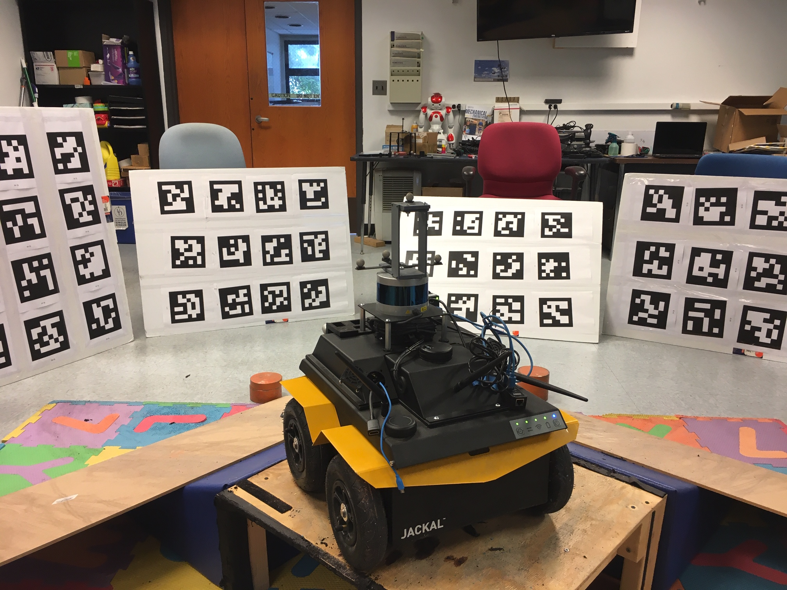
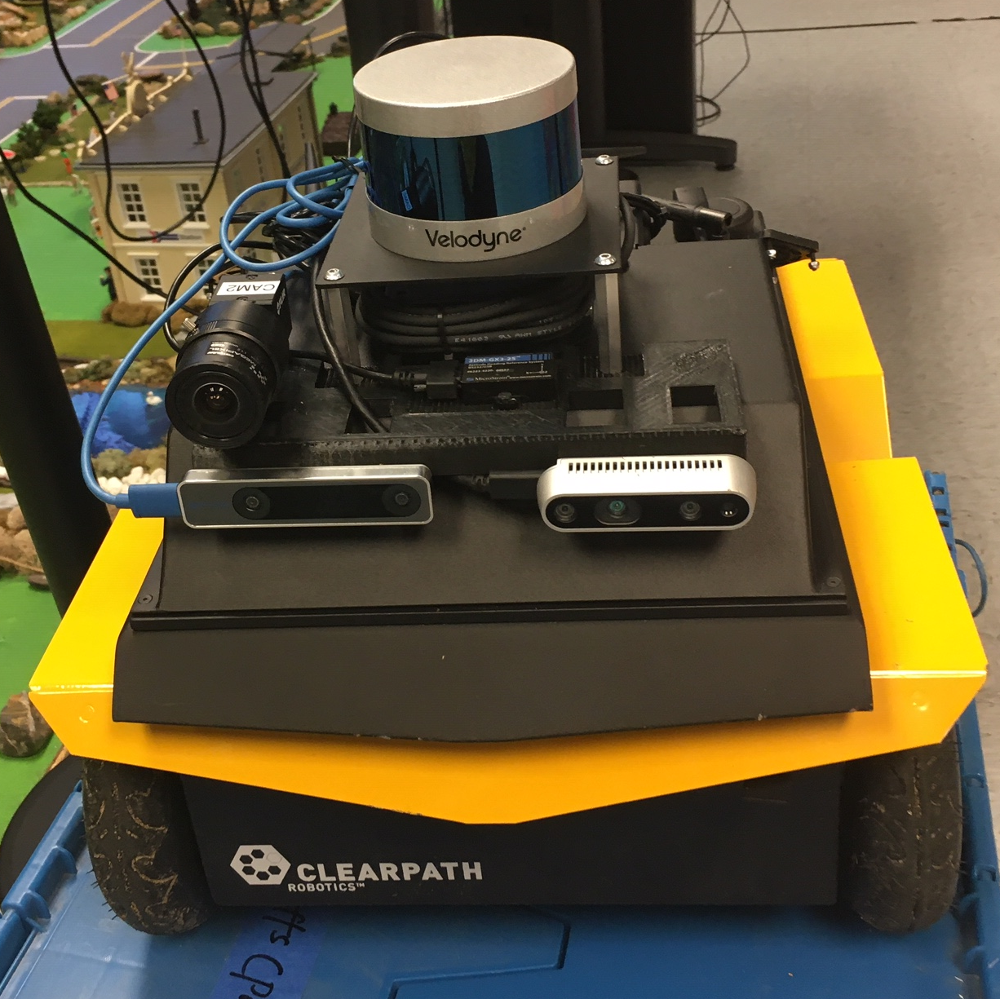

# icalib.github.io
Inertial Aided Multi-Sensor Calibration


## Description

To calibration the spatial-temporal parameters for multiple sensors, including IMU, cameras, LiDAR and wheel encoder. 

## Sensors 

#### Tested Sensors

* IMU: microstrain IMU, xsens IMU, realsense-t265 IMU / Gyro
* Cameras: FLIR Blackfly/pointgrey, t265 stereo-fisheye
* LiDAR: Velodyne VLP-16
* Wheel encoder: Jackal wheel encoder

#### Sensors going to support

* Ouster Lidar
* Accelerometer
* GPS / GNSS

## Requirements

* At least 1 IMU and 1 Camera (as the base IMU and base camera)
* QR tags: Aruco Tag (supported) and April Tag (testing)
* For LiDAR calibration: structural environment with planes
* Motion: 3D motion with at least 2-axis rotation
* 2 - 4 Tag planes (each plane with 6-9 tags)  as shown in the following fig


#### Example setup: 


The Jackal is equipped with: microstrain gx3-25, FLIR pointgrey, Realsense T265. The Jackcal contains wheel encoder.
From each sensor, the meassages needed are:

* Microstrain IMU: /imu_ms/data, sensor_msgs/Imu
* FLIR pointgrey: /camera_pg/image_raw, sensor_msgs/Image
* Realsense T265 Stereo: /camera/fisheye1/image_raw, /camera/fisheye2/image_raw, sensor_msgs/Image
* Realsense T265 gyro: /camera/gyro/sample, sensor_msgs/Imu
* Velodyne: /velodyne_packets, velodyne_msgs/VelodyneScan (important)
* Jackal wheel encoder: /joint_states, sensor_msgs/JoinState




## Supporting materials

* For iCalib [workshop paper](pdf/2021_vinsworkshop_iCalib.pdf).
* For iCalib [workshop slides](pdf/ICRA_2021_workshop_icalib_slides.pdf).
* For iCalib [workshop video](video/icalib_vins_workshop_yulin.mp4). 


## Dependencies

- OpenVINS - https://docs.openvins.com/gs-installing.html
- ROS Kinetic or Melodic - https://www.ros.org/
- OpenCV 3 or 4 - https://github.com/opencv/opencv
- libpointmatcher (our code with custom covariance) - https://github.com/rpng/libpointmatcher
    - clone into ros workspace
    - git clone https://github.com/ethz-asl/libnabo
    - git clone https://github.com/rpng/libpointmatcher
- Velodyne Drivers - https://github.com/ros-drivers/velodyne
	- Get here: https://github.com/ros-drivers/velodyne
	- Or: `sudo apt-get install ros-melodic-velodyne-msgs`
- To get MKL and TBB can follow this [link](https://software.intel.com/en-us/articles/installing-intel-free-libs-and-python-apt-repo)).

```cmd
wget https://apt.repos.intel.com/intel-gpg-keys/GPG-PUB-KEY-INTEL-SW-PRODUCTS-2019.PUB
sudo apt-key add GPG-PUB-KEY-INTEL-SW-PRODUCTS-2019.PUB
rm GPG-PUB-KEY-INTEL-SW-PRODUCTS-2019.PUB
sudo sh -c 'echo deb https://apt.repos.intel.com/mkl all main > /etc/apt/sources.list.d/intel-mkl.list'
sudo sh -c 'echo deb https://apt.repos.intel.com/tbb all main > /etc/apt/sources.list.d/intel-tbb.list'
sudo apt-get update
sudo apt-get install intel-tbb-2020.0-088
sudo apt-get install intel-mkl-2020.0-088
```

LZ4 error solution:
https://github.com/ethz-asl/lidar_align/issues/16#issuecomment-504348488

Eigne error can be solved by turning off the march=native. Which reference is [here](https://github.com/borglab/gtsam/issues/75#issuecomment-502809431
).